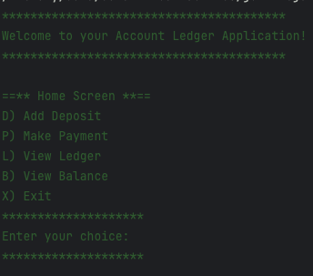
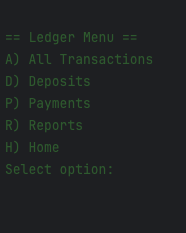
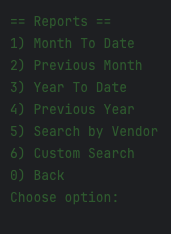

<<<<<<< HEAD
# Capstone1AccountLedger
=======
>>>>>>> 48e82cf (test)
# 💰 LedgerApp

This Java-based Ledger Application allows users to manage their personal finances efficiently. Users can add deposits, record payments, view transaction history, and generate detailed reports. All data is stored in a simple CSV format, making it portable and easy to manage.

---

<details>
<summary>💡 Technologies Used</summary>

- **Java 17+**
- **File I/O** (BufferedReader, FileWriter)
- **Collections API** (ArrayList, Comparator)
- **Java Time API** (LocalDate, LocalTime, DateTimeFormatter)

</details>

---

<details>
<summary>🧩 Features</summary>

### 🏠 Home Menu:
- **Add Deposit** – Input a deposit with description, vendor, and amount.
- **Make Payment** – Record an expense or payment with the necessary details.
- **View Ledger** – Access and navigate transaction records.
- **View Balance** – Instantly see the current account balance.

### 📓 Ledger Menu:
- **View All Transactions**
- **View Deposits Only**
- **View Payments Only**
- **Access Reports Menu**

### 📊 Reports Menu:
- **Month-to-Date Transactions**
- **Previous Month Transactions**
- **Year-to-Date Transactions**
- **Previous Year Transactions**
- **Search by Vendor Name**
- **Custom Search** – Search by date, description, vendor, or amount.

### 🔃 Automatic Sorting:
- All transactions are displayed **from newest to oldest** by default.

</details>

---

<details>
<summary>🖥️ Application Interface</summary>

#### 🏠 Home Menu:


#### 📓 Ledger Menu:


#### 📊 Reports Menu:


</details>

---

<details>
<summary>📁 File Structure</summary>

- `Main.java` – Contains the main logic and menus.
- `Transaction.java` – Defines the `Transaction` class and its properties.
- `transactions.csv` – Stores all transaction records.
- `report.csv` – Stores filtered/exported transaction reports.

</details>

---

<details>
<summary>🚀 How to Run</summary>

1. Ensure you have **Java 17 or later** installed.
2. Compile the source code:
   ```bash
   javac LedgerApp.java Transaction.java
